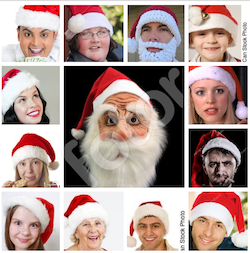
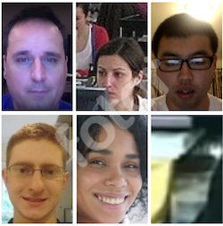
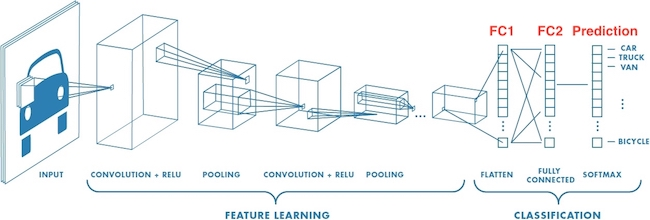

#Santa unmasked with Deep Learning (DL4J)
---


**_Created by Ordina - JTech_**

---

## Introduction
Christmas is a magic time. Each year, presents appear magically underneath our Christmas tree. It is rumored that a guy named Santa is responsible! But up until now, nobody seems to be able to catch him. At JTech, we want to prepare you for next Christmas by teaching you how to build a Santa detector with the help of the latest AI technologies.
You will be using DL4J to train a Deep Learning model that is able to catch Santa the next time that he is placing packages underneath the Christmas tree!

Requirements:

* Java 1.8
* Maven
* Laptop with webcam


This workshop consists of two parts. The first step towards recognizing Santa, is recognizing his handwriting. Therefor, we will teach you how to create a feed forward network using DL4J to recognize handwritten digits. 

Recognizing his handwriting is not enough ofcourse. Within the second part, we will teach you how to recognize Santa with the help of you webcam.

## Recognizing Santa's handwritten digits

To recognize Santa's handwritten digits, we would first need to obtain his written digits. The elves at DeepLearning4J have saved these in the so called `EMNIST` dataset. This dataset contains a collection of 60.000 handwritten digits of 0-9 by Santa himself! The digits have a dimension of 28x28px and contain a solid black background with a white digit. 


Instead of having to provide this data manually, DL4J provides this in the `EmnistDataSetIterator.Set.MNIST` so we can easily use this in our application.

You have been provided with some default settings. 

```java
HEIGHT: The height of the input image
WIDTH: The width of the input image
CHANNELS: The amount of channels (RGBA), we only use black and white so = 1
BATCH_SIZE: The amount of images to train in 1 iteration. The higher the batch-size, the fewer iterations.
SEED: = 123, psuedo-random number, will be explained later.

```


#### Assignment 1.1
Lets load the train and test data in our application so we have access to santa's written digits.
Go into to **SantaHandwritingNetwork.java** class and load the data iterators as follows:

```
emnistTrain = new EmnistDataSetIterator(EMNIST_SET, BATCH_SIZE, true);
emnistTest = new EmnistDataSetIterator(EMNIST_SET, BATCH_SIZE, false);

DataNormalization scaler = new ImagePreProcessingScaler(0, 1); // 1 channel, we only want to recognize black and white.
scaler.fit(emnistTrain);
scaler.fit(emnistTest);
```
This loads the train dataset iterator and the test dataset iterator by accessing the **EmnistDataSetIterator** provided by DeepLearning4J. 
Next we normalize the data to be sure that all train- & testdata dimensions are the same. 


### Feature extraction / Classification


Within most Convolution Neural Network we can identify two blocks.


* Feature extraction

* Classification


The feature extraction block consists of series of convolutional and pooling layers which are used to extract features from the image. With each layer, the complexity of the features increases. From simple features such as points and lines in the first layers, to more complex features such a shapes in the last layer.


These features are then fed to the fully connected layers (i.e. each input for that layer is connected to each output), which will classify the image based on the features. You can find more information [here](http://cs231n.github.io/convolutional-networks/)

To recognize Santa's handwriting, we will create a network with 1 feature extraction layer, coupled with a fully-connected layer and at last an output (classification) layer. 

#### Assignment 1.2
Now that our dataset iterators are setup, it's time to construct our very own neural network. DeepLearning4j helps us by providing a **NeuralNetConfiguration Builder**.

### Assignment 1.2a
Let's start by accessing this Configuration builder in **SantaHandwritingNetwork.java**:

```java
MultiLayerConfiguration networkConf = new NeuralNetConfiguration.Builder()
    .seed(SEED)
    .optimizationAlgo(OptimizationAlgorithm.STOCHASTIC_GRADIENT_DESCENT)
    .updater(new Nesterovs(5e-5))
    .weightInit(WeightInit.XAVIER)
    .list()
    //TODO Assignment 1.2b
    //TODO Assignment 1.2c
    //TODO Assignment 1.2d
    //TODO Assignment 1.2e
    .setInputType(InputType.convolutionalFlat(HEIGHT, WIDTH, CHANNELS))
    .build();
```

Let's look at this line by line:

```java
MultiLayerConfiguration networkConf = new NeuralNetConfiguration.Builder()
```
This initializes the Configuration by calling the Builder provided by DeepLearning4j.

```java
.seed(SEED)
```

The 'seed' is the starting point upon which future values are based. This is useful for debugging purposes: if you keep the seed the same from execution to execution you'll get the same numbers. For our network this will mean that if we train twice with the same seed and unchanged network, our network will stay consistent and achieve the same results as before. 

```java
.optimizationAlgo(OptimizationAlgorithm.STOCHASTIC_GRADIENT_DESCENT)
```
The optimization algorithm is how updates are made, given the gradient. The simplest (and most commonly used) method is stochastic gradient descent (SGD).

```java
.updater(new Nesterovs(5e-5))
```
In DL4J, the term ‘updater’ refers to training mechanisms that can result in much faster network training compared to ‘vanilla’ stochastic gradient descent.
A good default choice in most cases is to use the stochastic gradient descent optimization algorithm combined with the momentum updater (called NESTEROVS). 

```java
.weightInit(WeightInit.XAVIER)
```
We initialize the weights of the output node with a weight distribution. You need to make sure your weights are neither too big nor too small. Xavier weight initialization is usually a good choice for this.

```java
.list()
```
This allows us to add our layers to the network. That will be the next assignment.

```java
.setInputType(InputType.convolutionalFlat(HEIGHT, WIDTH, CHANNELS))
```
This automatically configures our input parameters for our network, now we don't have to specify these when creating layers.


Now we have created the skeleton for our digit recognizing network. This configuration won't work yet, we still need to add some layers!

### Assignment 1.2b
Let's start by adding a Convolution Layer to this network. 

```java
...
.weightInit(WeightInit.XAVIER)
.list()
.layer(new ConvolutionLayer.Builder()
    .activation(Activation.IDENTITY)
    .nOut(20)
    .build())
//TODO Assignment 1.2c
...
```
The Convolution layer applies a convolution operation (Activation function) to the input, passing the result to the next layer. The convolution emulates the response of an individual neuron
The chosen Activation function is 'Identity' which is a no-operation activation function. It maps the input to the output `y(x) = x`.

### Assignment 1.2c
Add a DenseLayer

```java
...
    .nOut(20)
    .build())
.layer(new DenseLayer.Builder()
    .activation(Activation.RELU)
    .nOut(200)
    .build())
// TODO Assignment 1.2e
...
```
A DenseLayer is a simple, standard fully-connected layer. This layer takes the output of our Convolutional Layer and connects all of it's outputs to it's own outputs (in this case 200 possible results). 
If you have some time left, you can play around with the `nOut` variables and check the impact on precision & performance.
The DenseLayer has a RELU activation function, (0 if x < 0, x for x >= 0), removes the negative parts of the input.

### Assignment 1.2d
The previous layers act as a basic feature extractor for our network. To convert these features into a recognized digit, we can add an OutputLayer.

```java
...
    .nOut(200)
    .build())
.layer(new OutputLayer.Builder(LossFunctions.LossFunction.NEGATIVELOGLIKELIHOOD)
    .activation(Activation.SOFTMAX)
    .nOut(NUM_CLASSES)
    .build())
.setInputType(InputType.convolutionalFlat(HEIGHT, WIDTH, CHANNELS))
.build();

network = new MultiLayerNetwork(networkConf);
```
We specify the LossFunction as a Negative Log Likelihood and add a SOFTMAX activation function.
For those interested, read [this article to see how and why they work together so well](https://ljvmiranda921.github.io/notebook/2017/08/13/softmax-and-the-negative-log-likelihood/) 

The `nOut` parameter specifies how many classes we want to output. Since we want to recognize 0-9, we set the `nOut` to 10.
Our own neural network is now ready. Time to start training on Santa's digits.


#### Assignment 1.3

The code below will iterate through our train data and feeds it to our network. For every 10 iterations, it will perform an evaluation and print it's statistics. The code and statistics will be elaborated more in the Santa Hat recognition part of this workshop.

```java
network.init();

Evaluation evaluation;

int iteration = 0;
while(emnistTrain.hasNext()) {
    network.fit(emnistTrain.next());

    if(iteration % 10 == 0) {
        log.info("Evaluate model at iter "+iteration+" ....");
        evaluation = network.evaluate(emnistTest);
        log.info(evaluation.stats());
        emnistTest.reset();
    }

    iteration++;
}
```


#### Assignment 1.4
Now that our network can be trained, we will save it so we can access it later.

```java
log.info("Model build complete");
//Save the model
File locationToSave = new File("MNISTNetwork.zip");
boolean saveUpdater = true;
ModelSerializer.writeModel(network, locationToSave, saveUpdater);
ModelSerializer.addObjectToFile(locationToSave, "labels", LABELS);
log.info("Model saved");
```
We are now ready to train & save our Network. 
Run **SantaHandwritingNetwork.java** and watch your network train!

The line `ModelSerializer.addObjectToFile(locationToSave, "labels", LABELS);` will store the LABELS used to train together with the network. This way we can retrieve the labels when we load the network in our classifier.

#### Assignment 1.5
Alright, the network has been trained and saved to our project root directory. Time to load the network in our application. Open **SantaHandwritingClassifier.java** and, in the constructor, load the network & labels from the `ModelSerializer`.

```java
public SantaHandwritingClassifier() {
    try {

        File networkFile = new File("MNISTNetwork.zip");     // The location where we have saved the neural network
        network = ModelSerializer.restoreMultilayerNetwork(networkFile);
        labels = ModelSerializer.getObjectFromFile(networkFile, "labels"); // retrieve the 'labels' object set earlier

    } catch(IOException ioe) {
        ioe.printStackTrace();
    }
}
```

#### Assignment 1.6
Inside the `passThroughNetwork` method, we will convert the `InputStream` to a INDArray and pass that INDArray to the network.  The network will try to determine what digit is in the image, by splitting the value 1 over the different digits. The higher the value, the higher the probability that the image contains that digit.

```
//Use the nativeImageLoader to convert the image to a numerical matrix
NativeImageLoader loader = new NativeImageLoader(28, 28, 1); //height, width, numChannels

INDArray image = loader.asMatrix(inputStream);

// the image needs to be scaled so they match train & test data
DataNormalization scaler = new ImagePreProcessingScaler(0, 1);
scaler.transform(image);

// pass through neural net and return output array
return network.output(image);
```

#### Assignment 1.7

Now to make our network output more readable, we convert the output to a `Prediction` array. This object contains a `label` and a `percentage`. The higher the percentage of the label, the more determined the neural network is that the image contains that label/digit.

```java
INDArray output = passThroughNetwork(inputStream);

List<Prediction> predictions = new ArrayList<>();

for(int i = 0; i < labels.size(); i++) {
    String label = labels.get(i);
    float predictionPercentage = output.getFloat(i);

    predictions.add(new Prediction(label, predictionPercentage));
}

return predictions;
```


And that's it. You created your own Neural Network which will train on the EMNIST dataset (which contains handwritten digits). The network is trained and saved. Next we wrote the classifier which loads the neural net from the filesystem and is able to take an inputstream and pass it through the neural net. 

Time to run. 

Open **nl.ordina.jtech.deeplearning.mnist.Application.java** and run it. Open your browser to `http://localhost:8080/` and draw your image.
Click on classify and see your neural net in action. Can your network recognize all of the digits correctly?

**For the very speedy ones**

Try adding more layers to your network and increase it's accuracy! Who can reach the 0.99 or above? And is it still accurate with your own handwritten digits or only Santa's? 
Check out the [DeepLearning4J - Cheat Sheet](https://deeplearning4j.org/docs/latest/deeplearning4j-cheat-sheet) for the possible layer types and what they mean.


## Recognizing Santa with your webcam

Now that you know how to recognize his handwriting, it is time train a Deep Learning network to recognize Santa. 

### Training data
The first step in training is gathering training data. To save you some time, we already include training data into the git repository. You can find this data in src -> main -> java -> resources .
The training data was created by using a scraper to download images from Google. 


 

#### Assignment 2.1
* Please go to the resources folder and explore the datasets!

### Transfer Learning
Since training a complete deep learning network can take a lot of time, we will be using a technique called Transfer Learning. With this technique we can use an existing network that was trained for recognizing images as our basis and retrain it to recognize Santa. 

The network which we will be using is the VGG16 network. This network has been trained to recognize a 1000 different objects. We will retrain this network to make it able to recognize between Santa and No Santa.


#### Assignment 2.2
We will first need to import the existing VGG16 network from the DL4J Model Zoo. Within the model Zoo, all kinds of pretrained models are available.

* Go to the **TransferLearningTrainer.java** class
* Load the model with the help of the following code

```java
//Import the VGG16 from the Model Zoo
ZooModel zooModel = VGG16.builder().build();
//Initialize the pre-trained weights
ComputationGraph vgg16 = (ComputationGraph) zooModel.initPretrained();
```

### VGG16 Classifcation.
Below is the architecture of the VGG16 ImageNet neural network. 



*(Image from [mathworks.com](Image from https://it.mathworks.com/solutions/deep-learning/convolutional-neural-network.html))*

When using transfer learning, instead of retraining the complete model, we will only retrain the last classification layer (FC2 in the image). This will reduce training time, while we still can use the already trained feature extraction layers of the model. 

#### Assignment 2.3
Since the VGG16 network has been trained on 1000 classes, and we only have two classes, we need to replace the output layer. Let's first create the new output layer with the following code. 

* Copy this code to the **TransferLearningTrainer.java** class 

```java
OutputLayer outputLayer = new OutputLayer.Builder(NEGATIVELOGLIKELIHOOD)//
    .nIn(4096)//Number of input nodes from the previous layer.
    .nOut(NUM_CLASSES)//The number of output nodes, should be equal to the number of output classes
    .weightInit(WeightInit.DISTRIBUTION) //Initialize the weights
    .dist(getDist()) //
    .activation(Activation.SOFTMAX)//
    .build();
```

Let's go through this code step by step:

```java
OutputLayer outputLayer = new OutputLayer.Builder(NEGATIVELOGLIKELIHOOD)//

```
The NEGATIVELOGLIKELIHOOD is the loss function we will be using. The loss function is used to assess the difference between the predicted outcome of the network, and the outcome it should have given. Based on the loss function, the weights can be changed in order to get closer to the answer which the network should have given.

```java
.nIn(4096)//Number of input nodes from the previous layer.
```
Since the we want to connect to the FC2 layer and this layer has 4096 output nodes
the number of input nodes for the Output (Prediction) layer should be 4096.

```java
.nOut(NUM_CLASSES)//The number of output nodes, should be equal to the number of output classes 
```
Since we have two classes (Santa / No Santa) we need to set the number of output nodes to two.


```java
.weightInit(WeightInit.DISTRIBUTION) //Initialize the weights
.dist(getDist()) //
```
We initialize the weights of the output node with a weight distribution. 


```java
.activation(Activation.SOFTMAX)//
```
The Softmax activation function will make sure that the output 
###Freezing the weights
Now that we have created the output layer, we should include it in the network architecture. Furthermore, we need to freeze all the weight before the FC2 layer. We can do this with the following code:

* Copy this code to the **TransferLearningTrainer.java** class 


```java
ComputationGraph vgg16Transfer = new TransferLearning.GraphBuilder(vgg16)//
    .fineTuneConfiguration(getFineTuneConfiguration())//
    .setFeatureExtractor("fc2") //the specified layer and below are "frozen"
    .removeVertexKeepConnections("predictions") //replace the functionality of the final layer
    .addLayer("predictions", outputLayer, "fc2").build();
```

Let's go through this code step by step:
```java
ComputationGraph vgg16Transfer = new TransferLearning.GraphBuilder(vgg16)//
```
Load the existing VGG16 Model

```java
.fineTuneConfiguration(getFineTuneConfiguration())//

```
Set the fineTuneConfiguration. We won't go into detail.

```java
.setFeatureExtractor("fc2") //the specified layer and below are "frozen"
```
Specifies which layer we want to retrain. The weights of all the other layers will be frozen. 

```java
.removeVertexKeepConnections("predictions") //replace the functionality of the final layer
.addLayer("predictions", outputLayer, "fc2")//
```
Remove the existing output layer (the one with the 1000 output nodes), and replace it by our own output layer (with just two nodes).


### Loading the data sets

To train our Network, we need to load our data sets and split them into a train set, and a test set. We can use the SantaDatasetIterator class in order to do so. This class will split the data and will also take care of defining the right pre-processors for your data. For example, the data needs to be reshaped to fit the 224*224 input neurons of the network. Furthermore, this class will also make sure that an iterator can be created to iterate over the dataset in batches. 

####Assignment 2.5

* Copy this code to the **TransferLearningTrainer.java** class 


```java
SantaDataSetIterator.setup(BATCH_SIZE, TRAIN_PERC);
DataSetIterator trainIter = SantaDataSetIterator.trainIterator();
DataSetIterator testIter = SantaDataSetIterator.testIterator();
```
The BATCH\_SIZE determines how many images will be fed trough the network before the network adjusts its weights. Adjusting this number might speed up or slow down your training, while at the same time decrease or improve the performance.

The TRAIN\_PERC determines what percentage of the data should be in the trainings set, and what percentage should be in the test set. 

### Training

Before we start training, we want to evaluate how well our untrained network is performing on the test set. We can do this with the help of the Evaluation class.

####Assignment 2.7
* Copy this code to the **TransferLearningTrainer.java** class 


```java
Evaluation eval = vgg16Transfer.evaluate(testIter);
log.info("Eval stats BEFORE fit....." + eval.stats() + "\n");
testIter.reset();

```
This will print some evaluation Metrics:

```
========================Evaluation Metrics========================
# of classes:    2
Accuracy:        0.6111
Precision:       0.6446
Recall:          0.6111
F1 Score:        0.6866        
```
**Accuracy**:  Is the ratio of correct predictions (Santa and No Santa) to the total number of predictions. 

**Precision**: Is the ratio of correct Santa predictions to the total number of Santa predictions.
This question that this answers is if the network predicted Santa, how often was it really Santa?

**Recall**: Recall is the ratio of correctly predicted Santa's to the all predictions in which the network predicted Santa. The question that this answers is: Of all the Santa's, how many did we detect.

**F1 Score**: The weighted average of Precision and Recall. Therefore, this score takes both false positives and false negatives into account. Intuitively it is not as easy to understand as accuracy, but F1 is usually more useful than accuracy, especially if you have an uneven class distribution. Accuracy works best if false positives and false negatives have similar cost. If the cost of false positives and false negatives are very different, it’s better to look at both Precision and Recall. 

####Assignment 2.8
* Copy this code to the **TransferLearningTrainer.java** class 


```java
int iter = 0;
while (trainIter.hasNext()) {

    vgg16Transfer.fit(trainIter.next());

    if (iter % 10 == 0) {
        log.info("Evaluate model at iter " + iter + " ....");
        eval = vgg16Transfer.evaluate(testIter);
        log.info(eval.stats());
        testIter.reset();
    }
    iter++;
}    
```

Let's go through this code step by step:


```java
while (trainIter.hasNext()) ...    
```
Loop through the dataset as long as there are unprocessed batches left. (In this case we will only loop once through the whole trainings data set, but often you have to encapsulate this loop into another loop to feed the complete data set to the network more than once. This can improve the performance.

```java 
vgg16Transfer.fit(trainIter.next());       
```
Feeds the batch of images into the network

```java
if (iter % 10 == 0) {
    log.info("Evaluate model at iter " + iter + " ....");
    eval = vgg16Transfer.evaluate(testIter);
    log.info(eval.stats());
    testIter.reset();
}    
```
Only evaluate the network after 10 batches have been processed. 


### Storing the network
We also want to store our freshly trained network and its weights. DL4J has some nice functionality in order to do so. 

####Assignment 2.9
* Copy this code to the **TransferLearningTrainer.java** class 


```java
File locationToSave = new File("SantaComputationGraph.zip");
ModelSerializer.writeModel(vgg16Transfer, locationToSave, false);
ModelSerializer.addObjectToFile(locationToSave, "labels", SantaDataSetIterator.getLabels());
```

This code lets us write the model to a zip file, and adds the labels of the different classes. 


####Assignment 2.10
* You can now run the **TransferLearningTrainer.java** class and train you network. Look at the evaluation metrics and confusion matrix to see how your network is performing.

If you get a memory exception, try lowering the BATCH_SIZE.

####Assignment 2.11
After training your network, we can imagine you want to see how it performs and if its able to detect Santa! The classification of your webcam images is done in the SantaClassifier.java.
In order to detect Santa, we need to load our freshly trained model.

* Copy this code to the **SantaClassifier.java** class 

```java
File santaComputationGraphFile = new File("SantaComputationGraph.zip");
santaComputationGraph = ModelSerializer.restoreComputationGraph("SantaComputationGraph.zip");
labels = ModelSerializer.getObjectFromFile(santaComputationGraphFile, "labels");
```
This code will load our network and its labels.


* Run the Application.java class
* Open your browser and go to http://localhost:8080
* Put your Santa hat on to imitate Santa!
* Install your laptop underneath the Christmas tree


_(Image from [raspberrypi.org](https://projects.raspberrypi.org/en/projects/santa-detector))_

###Bonus
* If you have any time left, create your own dataset (for example with the Antlers) and retrain your network!


#Thanks
Thanks for attending this workshop, we hoped that you enjoyed it!

### References
The code used in this workshop is based on the following [code](https://github.com/deeplearning4j/dl4j-examples/tree/master/dl4j-examples/src/main/java/org/deeplearning4j/examples/transferlearning/vgg16)

***
© Ordina - JTech 2019
